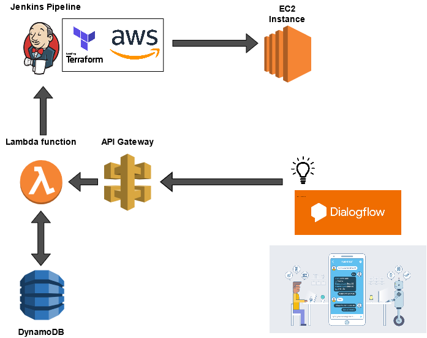

# ChatOps DialogFlow



Este projeto tem como objetivo prover um fluxo de self service para desenvolvedores que precisam de uma instância do tipo EC2 para desenvolvimento ou validação.

## Requirements on AWS
- [x] [Lambda Function](https://console.aws.amazon.com/lambda/) - com runtime `Python 3.6` e com a função conforme arquivo `AWS/lambda_funtion.py`

- [x] [API Gateway](https://console.aws.amazon.com/apigateway/)  com um método POST configurado linkado ao `Lambda`

- [x] [Dynamo DB](https://console.aws.amazon.com/dynamodb/) - Foi criado uma tabela `infrastructure` com 3 items 

| quantity | resource | balance
| -------- |:-------:|:-------:|
|    `1`  |  `ec2` | `0`

## Requirements on Jenkins
- [x] Terraform

- [x] Webhook trigger on Jenkins Pipeline

## Requirements on Dialog flow

- [x] Criar a intenção para deploy de uma **EC2**
````
name: deploy-ec2
----
Training phrases
Ex:
"quero criar 1 ec2 na aws"
"preciso de 3 instancias ec2 na aws"
"quero 10 ec2"
----
Action and parameters
parameter name: quantidade
entity: @sys.number
value: $quantidade
````
- Ativar o Webhook na seção `Fulfillment` com a URL gerada pelo `API Gateway`

